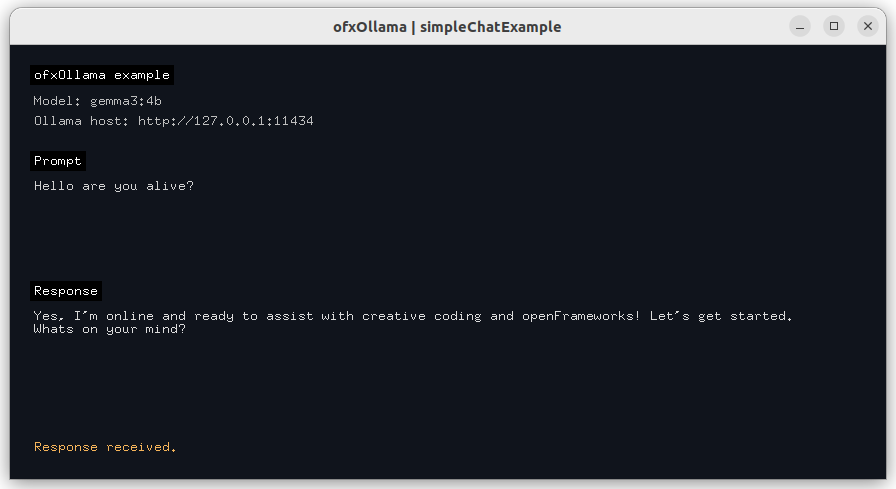

# ofxOllama

`ofxOllama` is an openFrameworks addon to interface with Ollama.


## Requirements

1. openFrameworks installed.
2. Ollama installed and running locally.


```cpp
#include "ofxOllama.h"

ofxOllama::setModel("gemma3:4b");

auto client = std::make_shared<ofxOllama::Client>();
if (!client->isAvailable()) {
    ofLogError() << "Ollama is not reachable at " << client->getHost();
    return;
}

ofxOllama::Agent agent(client);
agent.setRole("You are a professional assistant that answers the questions in 2 or 3 sentences.");

auto result = agent.ask("Give me one creative coding idea.");

if(result.success){
    ofLogNotice() << result.text;
}else{
    ofLogError() << "Request failed [code=" << static_cast<int>(result.errorCode)
                 << "]: " << result.error;
}
```

Run the examples:

```sh
make -C examples/textExample -j -s
make -C examples/textExample RunRelease

make -C examples/imageExample -j -s
make -C examples/imageExample RunRelease

make -C examples/simpleChatExample -j -s
make -C examples/simpleChatExample RunRelease

# build and run all examples (sequential)
set -e && make -C examples/textExample -j -s && make -C examples/textExample RunRelease && make -C examples/imageExample -j -s && make -C examples/imageExample RunRelease && make -C examples/simpleChatExample -j -s && make -C examples/simpleChatExample RunRelease
```

VS Code workspace setup (Linux + Windows):

```sh
# Linux: 
sudo apt update && sudo apt install -y build-essential pkg-config curl && code ofxOllama.code-workspace
# Windows (MSYS2 MinGW64): 
pacman -S --needed --noconfirm mingw-w64-x86_64-toolchain make pkgconf curl git
```


